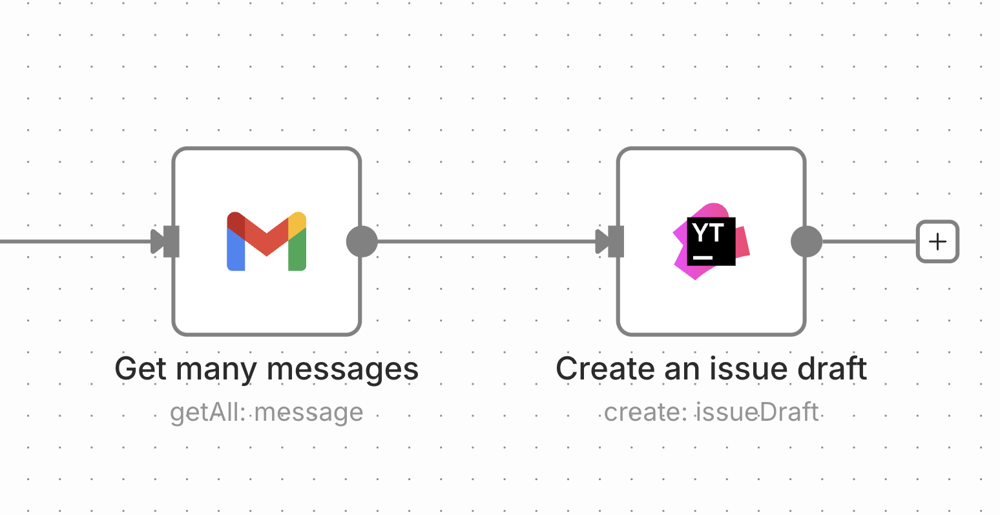
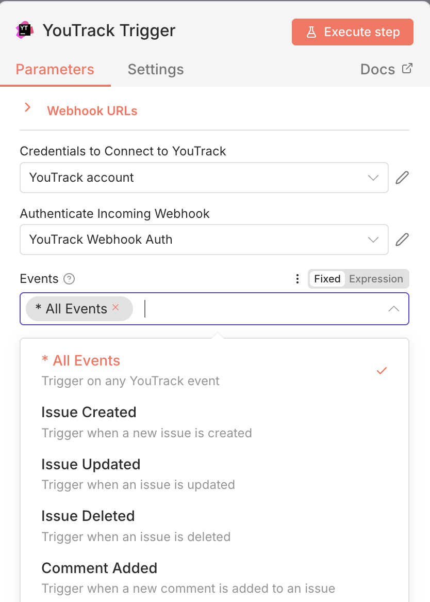

# n8n-nodes-youtrack

This is an n8n community node. It lets you use YouTrack in your n8n workflows.

YouTrack is a project management and issue tracking tool by JetBrains that helps teams manage projects, track issues, and collaborate effectively.

[n8n](https://n8n.io/) is a [fair-code licensed](https://docs.n8n.io/reference/license/) workflow automation platform.

[Installation](#installation)  
[Actions](#actions)  
[Credentials](#credentials)  
[Compatibility](#compatibility)  
[Usage](#usage)  
[Resources](#resources)  

## Installation

Follow the [installation guide](https://docs.n8n.io/integrations/community-nodes/installation/) in the n8n community nodes documentation.

## Actions
Actions allow users to integrate the [YouTrack REST API](https://www.jetbrains.com/help/youtrack/devportal/youtrack-rest-api.html) in their n8n workflows.

The YouTrack node supports the following resources and operations:

### Command
- **Execute** - Execute YouTrack commands on one or more issues (bulk operations supported). Supports all YouTrack commands: tags, assignees, comments, work items, votes, watchers, links, custom fields, and more.

### Comment
- **Add** - Add a comment to an issue
- **List** - List all comments on an issue

### Issue
- **Create** - Create a new issue
- **Delete** - Delete an issue
- **Get** - Get an issue by ID
- **List** - List issues
- **Update** - Update an issue

### Issue Draft
- **Create** - Create a new issue draft
- **Delete** - Delete an issue draft
- **Get** - Get an issue draft by ID
- **List** - List issue drafts
- **Update** - Update an issue draft

### Project
- **Get** - Get a specific project
- **Get Fields Schema** - Get the JSON schema for custom fields in the specified project
- **Get Issues** - Get issues for a specific project
- **List** - List all projects

### Saved Query
- **Create** - Create a new saved query
- **List** - List all saved queries visible to the current user

### Tag
- **Add to Issue** - Add a tag to an issue
- **Get Issue Tags** - Get all tags on a specific issue
- **List** - List all available tags
- **Remove From Issue** - Remove a tag from an issue

### User
- **Get** - Get a specific user by ID or login
- **Get Current** - Get current authenticated user
- **Get General Profile** - Get general profile settings for a specific user
- **Get Notifications Profile** - Get notification settings for a specific user
- **Get Saved Queries** - Get saved queries for a specific user
- **Get Tags** - Get tags for a specific user
- **Get Time Tracking Profile** - Get time tracking settings for a specific user
- **List** - List users

### User Group
- **Get** - Get a specific user group by ID
- **Get Members** - Get members of a user group
- **List** - List user groups

### Work Item
- **Add** - Add a work item (time tracking) to an issue

## YouTrack Trigger (Webhook)

The YouTrack Trigger node allows you to start workflows automatically when events occur in YouTrack (e.g., issue created, updated, deleted).

### Supported Events

- Issue Created
- Issue Updated  
- Issue Deleted
- Comment Added
- Comment Updated
- Comment Deleted
- Work Item Added
- Work Item Updated
- Work Item Deleted
- Issue Attachment Added
- Issue Attachment Deleted

---

## Credentials

To use the YouTrack node, you need to authenticate with your YouTrack instance using a permanent token.

### Prerequisites

1. Access to a YouTrack instance (cloud or server)
2. A YouTrack account with appropriate permissions

### Setting Up Authentication

1. **Generate a Permanent Token in YouTrack**
2. **Configure Credentials in n8n**:
   - In n8n, go to **Credentials** > **Create Credential**
   - Select **YouTrack API**
   - Enter your **YouTrack URL** (e.g., `https://your-instance.myjetbrains.com/youtrack` or `http://localhost:8088` for self-hosted)
     - Note: Enter the base URL without `/api` at the end
   - Enter your **Permanent Token**
   - Click **Save**

The node uses Bearer token authentication and will automatically include the token in all API requests.

## Compatibility

- **n8n Nodes API Version**: 1
- **YouTrack API**: Compatible with YouTrack REST API

**Note**: This node requires n8n version that supports community nodes with API version 1. If you encounter compatibility issues, please ensure you're using a recent version of n8n.

## Usage

### Command Execute

The **Command Execute** operation allows you to apply YouTrack commands to issues using natural language syntax. Examples:
- `tag MyTag for me` - Adds "MyTag" to issue and assigns it to you
- `tag To Deploy for jane.doe` - Adds "To Deploy" tag and assigns to jane.doe
- `work 2h Fixed bug` - Logs 2 hours of work with a comment

Note: `vote+1` cannot be used on your own issues, and usernames must be valid YouTrack logins.

### Custom Fields

To discover available custom fields for a project, use the **Project > Get Fields Schema** operation, which returns the JSON schema for all custom fields in the specified project.

### Issue Queries

When listing or filtering issues, YouTrack uses its own query language. See the [YouTrack Query Syntax documentation](https://www.jetbrains.com/help/youtrack/incloud/Search-and-Command-Attributes.html) for details.

### Webhooks

For webhook triggers, you need to configure webhook subscriptions in your YouTrack instance. The YouTrack Trigger node will provide you with the webhook URL to use during setup.

## Resources

* [n8n community nodes documentation](https://docs.n8n.io/integrations/#community-nodes)
* [YouTrack REST API documentation](https://www.jetbrains.com/help/youtrack/devportal/youtrack-rest-api.html)
* [YouTrack documentation](https://www.jetbrains.com/help/youtrack/)
